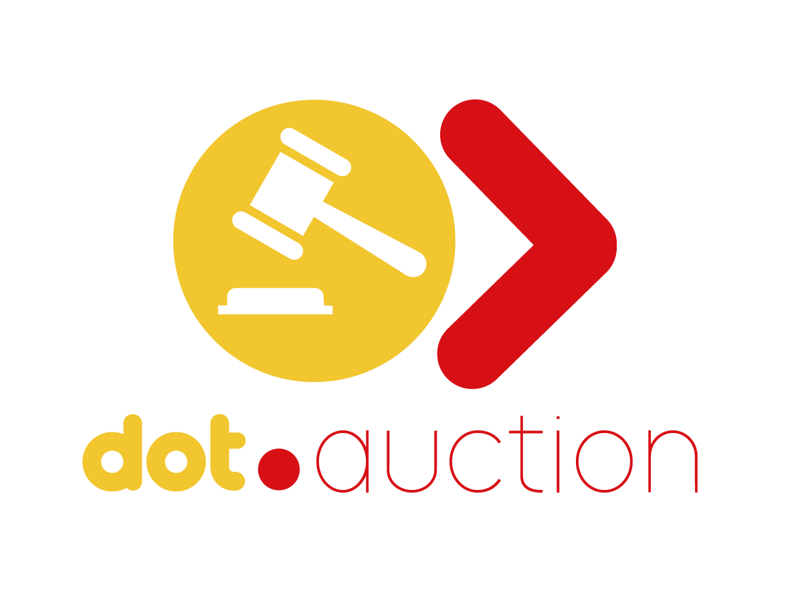

<div align="center">



<br /><br />

**List items, place live bids, and win with confidence.**

<br />

   

<br /><br />

**Part of the [Dot Ecosystem](https://github.com/sakhileb/InfoDot)** &nbsp;·&nbsp; `auction.infodot.app`

</div>

---

## What is Dot.Auction?

Dot.Auction is the live-bidding platform in the Dot ecosystem. Sellers list items with a starting
price and a fixed auction window; buyers browse, watch, and bid in real time, with automatic
highest-bid tracking and reserve-price confidentiality.

**Status:** built and running as a Laravel application. See [`wiki.md`](wiki.md) for the full,
kept-honest breakdown of what's actually implemented vs. still roadmap.

## Core Features (implemented today)

- Real auction schema: auctions, bids, categories, watchlist, and auction items
- Live bid broadcasting via Laravel Reverb (`App\Events\BidPlaced` on `auction.{id}`)
- Seller operations dashboard — active lots, bids received, categories, watchlist volume, and an
  "ending soon" widget
- Buyer-facing marketplace: search/filter auctions by title, category, and status (`/auctions`)
- Auction detail + live bidding page (`/auctions/{auction}`), including the previously
  unrendered `BidPanel` Livewire component
- Reserve-price confidentiality: buyer-facing views only ever see "reserve met / not met" — the
  actual reserve amount is never sent to a non-seller
- Buyer watchlist toggle (add/remove an auction from your watchlist)
- In-app notification bell (Laravel's `database` notification channel); an outbid notification
  fires automatically the moment someone else outbids you
- Dark / light mode toggle (Tailwind class-based strategy, persisted per browser)
- Ecosystem SSO from the Dot hub

> **Not yet built:** auto-bid execution (the `is_auto_bid` column exists, no engine acts on it),
> an auction settlement job (nothing flips `status` to `ended` automatically when `ends_at`
> passes), dispute resolution, and the Knowledge Pack publisher to Dot.Brain.
> `AuctionWonNotification` and `AuctionEndingSoonNotification` classes exist but have no
> automatic trigger yet — they're ready for the settlement job / scheduled sweep once those
> exist. See `wiki.md` §6 for the full roadmap. Earlier drafts of this README described
> fictitious models (`AuctionLot`, `AuctionResult`) that were never implemented — the real
> domain models are listed below.

## Domain Models

- **Auction** — item/lot listed for bidding, with starting/reserve/current/buy-now price and a
  status lifecycle (`draft` → `active` → `ended`/`cancelled`)
- **Bid** — placed bid with amount, `is_winning` flag, and `is_auto_bid` flag (unused today)
- **AuctionCategory** — simple taxonomy
- **Watchlist** — buyer-side interest tracker (`user_id` + `auction_id`)
- **AuctionItem** — item-level detail attached to an auction (condition, location)

## Tech Stack

| Layer | Technology |
|---|---|
| Framework | Laravel 12 |
| Language | PHP 8.4 |
| Frontend | Livewire 3 · Alpine.js 3 · Tailwind CSS |
| Database | PostgreSQL 16 (shared `infodot` database across the ecosystem) |
| Realtime | Laravel Reverb (bid broadcasting) |
| Auth | Laravel Jetstream + Sanctum, team-based accounts (InfoDot SSO) |
| AI | Anthropic Claude (`ANTHROPIC_API_KEY`, `claude-sonnet-4-6`) — config only, not called by any auction logic yet |
| Queue | Database-backed queue |

## Quick Start

```bash
git clone https://github.com/sakhileb/Dot.Auction.git
cd Dot.Auction
cp .env.example .env
composer install
npm install && npm run build
php artisan key:generate
php artisan migrate
php artisan serve
```

> **Ecosystem SSO:** Set `DB_*` env vars to the shared InfoDot PostgreSQL instance and
> `APP_URL=https://auction.infodot.app`. Users authenticated through InfoDot gain access
> automatically via the Sanctum handoff at `/auth/ecosystem`.

### Running Tests

```bash
php artisan test
```

Feature tests use an in-memory SQLite connection (see `phpunit.xml`) and Laravel's
`RefreshDatabase` trait — no shared Postgres instance required to run them.

## Ecosystem

**Dot.Auction** is one of the platforms in the Dot ecosystem, connected via shared PostgreSQL and
Sanctum SSO. Visit [Dot.Brain](https://github.com/sakhilebhayi/Dot.Brain) for the ecosystem-wide
knowledge repo, and [`wiki.md`](wiki.md) for this platform's own source of truth.

## License

MIT © [SK Digital / BluPin Incorporated](https://github.com/sakhileb)
